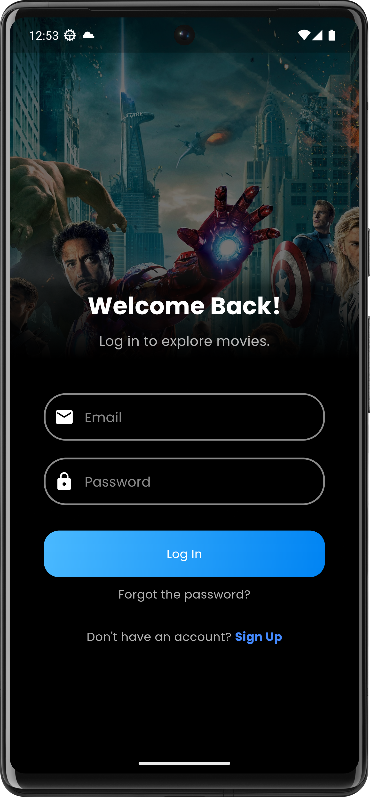
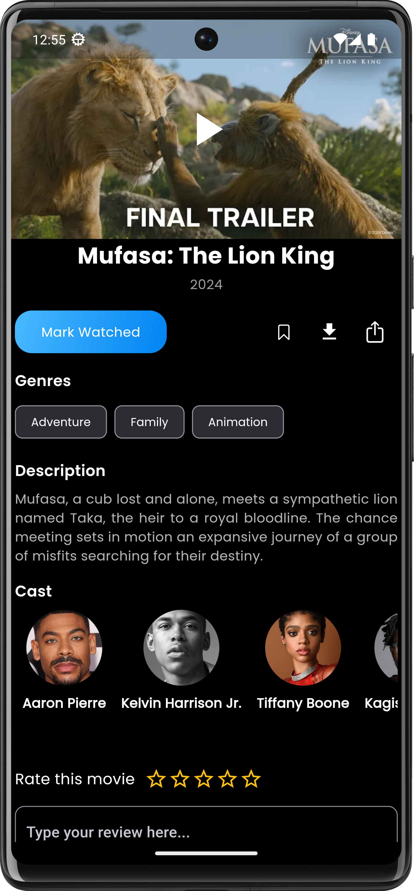

# 🎥 MovieVerse 🔗

  
  


**MovieVerse** is a modern Flutter-based movie recommendation app that provides personalized movie suggestions. It features real-time data integration, user reviews, a rating system, and content-based filtering. Built using **Firebase** as the backend, **Riverpod** for state management, and **The Movie DB API** for movie data.

---

## 📱 Screenshots

<p align="center">  
    
    
    
    
</p>  

---

## 🚀 Key Features

- **User Authentication**
    - Secure login and signup using **Firebase Authentication**.

- **Personalized Recommendations**
    - Implements **content-based filtering** to provide tailored movie suggestions.

- **Real-Time Movie Data**
    - Integrated **The Movie DB API** for live movie details, posters, and ratings.

- **Review and Rating System**
    - Users can review and rate movies to help others make informed choices.

- **State Management with Riverpod**
    - Efficient and scalable state management for seamless app performance.

- **Responsive UI Design**
    - A modern, user-friendly design optimized for both Android and iOS.

- **Dark Mode Support**
    - Enjoy a beautiful UI in dark themes.

---

## 🏗️ Architecture

The app follows the **MVVM (Model-View-ViewModel)** architecture pattern for clean and maintainable code:

```
lib/  
├── models/         # Data models and entities  
├── views/          # UI components and screens  
│   └── widgets/    # Reusable UI components  
├── view_models/    # Business logic and state management  
├── services/       # API and external services  
└── themes/         # Theme definitions  
```

---

## 🛠️ Technology Stack

- **Flutter 3.x**: Modern UI framework for cross-platform development.
- **Firebase**: Backend for authentication, real-time data, and storage.
- **Riverpod**: Powerful state management solution.
- **The Movie DB API**: Real-time movie data integration.
- **Google Fonts**: Premium typography for a clean look.

---

## 🚀 Getting Started

1. **Clone the repository**
```bash  
git clone https://github.com/zsifat/movieverse.git  
```  

2. **Install dependencies**
```bash  
flutter pub get  
```  

3. **Run the application**
```bash  
flutter run  
```  

---

## 🤝 Contributing

Contributions are welcome! Feel free to:
- Report bugs
- Suggest new features
- Submit pull requests

---

## 📄 License

This project is licensed under the MIT License - see the [LICENSE](LICENSE) file for details.

---

## 👨‍💻 Developer

**Zahid**
- GitHub: [@zsifat](https://github.com/zsifat)
- LinkedIn: [@zahidulislam](https://www.linkedin.com/in/zahidulislam1/)

---

## 🌟 Show Your Support

Give a ⭐️ if you like this project!

---

<p align="center">Made with ❤️ by Zahid</p>  
